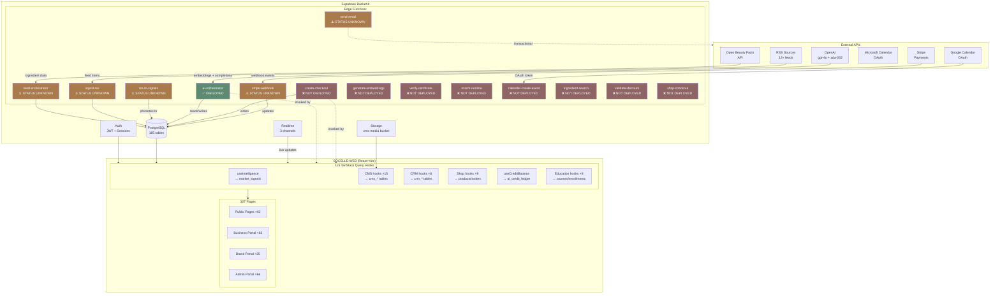

# SOCELLE GLOBAL — API LOGIC MAP
**Generated:** 2026-03-09
**Method:** 5-agent parallel repo-wide scan (ENV, edge functions, DB tables, hooks, routes)
**Scope:** All boundary crossings — Supabase DB/Auth/Storage/Realtime, Edge Functions, third-party SDKs, HTTP calls
**Authority:** OPERATION_BREAKOUT.md + CLAUDE.md §16

---

## 1. EXECUTIVE SUMMARY

| Metric | Count | Notes |
|--------|-------|-------|
| Total env vars referenced | 18 | 5 set, 6 stub/unset, 2 server-side placeholders |
| Edge functions deployed locally | 1 | `ai-orchestrator` only |
| Edge functions called in code | 11 | 10 missing implementations |
| DB tables referenced in code | 165 | 115 hooks consuming them |
| Custom data hooks | 115 | 98 TanStack Query, 3 realtime, 3 context |
| Direct RPC calls | 8 | claim, deduct_credits, vector search, order ops |
| Realtime subscriptions | 3 | subscriptions, module_access, messages |
| Storage bucket operations | 3 | CMS media only |
| Total pages/routes | 307 | ~35 LIVE, ~8 DEMO, ~8+ STUB |

### Top 10 Broken / Missing Wiring Points (Revenue Impact Order)

| # | Item | Impact | Evidence |
|---|------|--------|----------|
| 1 | `OPENAI_API_KEY` + `SUPABASE_SERVICE_ROLE_KEY` are placeholders | AI features completely broken | `supabase/.env` lines 11, 15 |
| 2 | 10 edge functions called in code with no local implementation | Payments, education, calendar, shop, ingredients all broken | `lib/useSubscription.ts:112`, `lib/useCertificates.ts:66`, etc. |
| 3 | Rate limiting NOT in `ai-orchestrator` | Unlimited AI calls — liability + cost bleed | OPERATION_BREAKOUT.md INFRA-06 |
| 4 | `VITE_STRIPE_PUBLISHABLE_KEY` not set | All checkout flows broken | `SOCELLE-WEB/.env` (missing) |
| 5 | Feed deduplication missing | Duplicate signals corrupt intelligence feed | OPERATION_BREAKOUT.md INFRA-05 |
| 6 | Dead letter queue absent | Failed feed items silently lost | OPERATION_BREAKOUT.md INFRA-05 |
| 7 | `database.types.ts` covers 116 of 165 referenced tables | 49 tables have no TypeScript types → type errors at build | P0-03 partial |
| 8 | 3 DEMO surfaces missing LIVE/DEMO badge | Free-tier users see unlabeled fake data | `BenchmarkDashboard.tsx`, `IntelligenceReport.tsx`, `IntelligencePricing.tsx` |
| 9 | pgvector extension activation unverified | `match_protocols` RPC and AI search could fail at runtime | INFRA-08 status UNKNOWN |
| 10 | 29 unit tests failing (`@testing-library/react` v16 / React 19 compat) | CI gate broken | build_tracker.md P2-1 |

---

## 2. MASTER API REGISTRY

### 2A — Environment Variables

| Key | Set? | Referenced In | Purpose | Required For |
|-----|------|---------------|---------|--------------|
| `VITE_SUPABASE_URL` | ✅ SET | `lib/supabase.ts`, `lib/emailService.ts`, `ConfigCheck.tsx` | Supabase project endpoint | All hubs |
| `VITE_SUPABASE_ANON_KEY` | ✅ SET | `lib/supabase.ts`, `lib/emailService.ts`, `ConfigCheck.tsx` | Public anon JWT | All hubs |
| `VITE_SUPABASE_BYPASS` | ✅ SET | `lib/supabase.ts`, `ConfigCheck.tsx` | UI-only mode (no DB) | Dev/staging |
| `VITE_DEV_ADMIN_EMAIL` | ✅ SET | `.env` only | Dev login bypass | Dev only |
| `VITE_DEV_ADMIN_PASSWORD` | ✅ SET (plaintext) | `.env` only | Dev login bypass | Dev only |
| `VITE_SUPPORT_EMAIL` | ✅ SET | `.env` | User-facing support address | Public pages |
| `VITE_STRIPE_PUBLISHABLE_KEY` | ❌ NOT SET | `pages/public/Checkout.tsx` | Stripe Elements init | Commerce/Payments |
| `VITE_PAYMENT_BYPASS` | 📄 DOCUMENTED | `lib/paymentBypass.ts` | Dev payment bypass | Dev only |
| `VITE_TEST_MODE` | 📄 DOCUMENTED | `StagingBanner.tsx` | Staging indicator | Staging |
| `VITE_DEPLOY_BRANCH` | 📄 DOCUMENTED | `StagingBanner.tsx` | Git branch display | Staging |
| `VITE_DEPLOY_SHA` | 📄 DOCUMENTED | `StagingBanner.tsx` | Git SHA display | Staging |
| `VITE_PRELAUNCH_MODE` | 📄 DOCUMENTED | `PrelaunchGuard.tsx` | Prelaunch gate toggle | Pre-launch |
| `VITE_ENRICHMENT_PROXY_URL` | ❌ NOT SET | `lib/enrichment/enrichmentService.ts` | Enrichment service proxy | INTEL-WO |
| `VITE_VAPID_PUBLIC_KEY` | ❌ NOT SET | `PWAInstallPrompt.tsx` | Web Push VAPID key | PWA-WO |
| `VITE_GOOGLE_OAUTH_CLIENT_ID` | ❌ NOT SET | `pages/business/CrmTasks.tsx` | Google Calendar OAuth | CRM calendar sync |
| `VITE_MICROSOFT_OAUTH_CLIENT_ID` | ❌ NOT SET | `pages/business/CrmTasks.tsx` | Microsoft Outlook OAuth | CRM calendar sync |
| `VITE_CALENDAR_OAUTH_REDIRECT_URI` | ❌ NOT SET | `pages/business/CrmTasks.tsx` | Calendar OAuth redirect | CRM calendar sync |
| `VITE_SHOW_MASTER_LINKS` | 📄 DOCUMENTED | `DevOnlyMasterLinks.tsx` | Dev master link panel | Dev only |
| `SUPABASE_SERVICE_ROLE_KEY` | ⚠️ PLACEHOLDER | `supabase/.env` (server-side) | Elevated DB access for edge fns | All edge functions |
| `SUPABASE_ANON_KEY` | ✅ SET | `supabase/.env` (server-side) | Public key fallback | Edge functions |
| `OPENAI_API_KEY` | ⚠️ PLACEHOLDER | `supabase/.env` (server-side) | LLM + embeddings | `ai-orchestrator` |

### 2B — Edge Functions Registry

| Function | Status | Auth | Callers | Tables/External | Missing? |
|----------|--------|------|---------|-----------------|----------|
| `ai-orchestrator` | ✅ DEPLOYED | JWT verify | `lib/aiConciergeEngine.ts:164` | `match_pro_products` RPC, OpenAI embeddings + gpt-4o | Keys are placeholders |
| `generate-embeddings` | ❌ NOT DEPLOYED | JWT | `lib/mappingEngine.ts:89` | pgvector (unverified) | Implementation file missing |
| `verify-certificate` | ❌ NOT DEPLOYED | JWT | `lib/useCertificates.ts:66`, `pages/education/CertificateVerify.tsx:42` | `certificates` table | Implementation file missing |
| `create-checkout` | ❌ NOT DEPLOYED | JWT | `lib/useSubscription.ts:112,132` | `subscriptions`, Stripe API | Implementation file missing |
| `ingredient-search` | ❌ NOT DEPLOYED | JWT | `lib/useIngredientSearch.ts:78` | `ingredients` table | Implementation file missing |
| `scorm-runtime` | ❌ NOT DEPLOYED | JWT | `lib/useScorm.ts:128`, `pages/education/ScormPlayer.tsx:43` | `scorm_tracking`, `scorm_packages` | Implementation file missing |
| `calendar-create-event` | ❌ NOT DEPLOYED | JWT | `pages/business/CrmTasks.tsx:680` | `calendar_connections`, Google/Microsoft API | Implementation file missing + OAuth keys unset |
| `process-scorm-upload` | ❌ NOT DEPLOYED | JWT | `pages/admin/AdminCoursesHub.tsx:155` | `scorm_packages`, Storage | Implementation file missing |
| `test-api-connection` | ❌ NOT DEPLOYED | JWT | `pages/admin/ApiDashboard.tsx:393` | `api_registry` | Implementation file missing |
| `open-beauty-facts-sync` | ❌ NOT DEPLOYED | JWT | `pages/admin/AdminIngredientsHub.tsx:186` | `ingredients`, Open Beauty Facts API | Implementation file missing |
| `validate-discount` | ❌ NOT DEPLOYED | JWT | `pages/public/Cart.tsx:24` | `discount_codes` | Implementation file missing |
| `shop-checkout` | ❌ NOT DEPLOYED | JWT | `pages/public/Checkout.tsx:79` | `orders`, `order_items`, `carts` | Implementation file missing |
| `send-email` | STATUS UNKNOWN | Bearer | `lib/emailService.ts:14` (raw fetch) | Transactional email (no provider confirmed) | Local file not found; may be remote-only |
| `feed-orchestrator` | STATUS UNKNOWN | — | Not found in frontend code | `data_feeds`, `market_signals` | Local file not found; OPERATION_BREAKOUT says "VERIFIED" — may be remote-only |
| `ingest-rss` | STATUS UNKNOWN | — | Not found in frontend code | `rss_items`, `rss_sources` | Local file not found; OPERATION_BREAKOUT says "VERIFIED" |
| `rss-to-signals` | STATUS UNKNOWN | — | Not found in frontend code | `rss_items` → `market_signals` | Local file not found; OPERATION_BREAKOUT says "VERIFIED" |
| `stripe-webhook` | STATUS UNKNOWN | Stripe signature | Not found in frontend code | `subscriptions`, `account_subscriptions` | Local file not found; OPERATION_BREAKOUT says "VERIFIED" |

> **Note:** OPERATION_BREAKOUT.md lists feed-orchestrator, ingest-rss, rss-to-signals, stripe-webhook as "VERIFIED" but no local implementation files exist under `supabase/functions/`. These may be deployed remotely to the Supabase project (`rumdmulxzmjtsplsjngi`) without local copies. Verify via Supabase Dashboard → Edge Functions.

### 2C — Third-Party SDK Registry

| Provider | SDK | Version | Where Configured | Where Called | Status |
|----------|-----|---------|-----------------|--------------|--------|
| Supabase | `@supabase/supabase-js` | ^2.57.4 | `lib/supabase.ts` | All 115 hooks, all portals | ✅ LIVE |
| Stripe | `@stripe/react-stripe-js` + `@stripe/stripe-js` | ^5.6.1 / ^8.9.0 | `VITE_STRIPE_PUBLISHABLE_KEY` (unset) | `pages/public/Checkout.tsx` | ⚠️ STUB — key missing |
| OpenAI | Direct HTTP (Deno fetch) | — | `OPENAI_API_KEY` in `supabase/.env` (placeholder) | `supabase/functions/ai-orchestrator/index.ts:19,72` | ⚠️ PLACEHOLDER |
| Google Calendar | OAuth 2.0 | — | `VITE_GOOGLE_OAUTH_CLIENT_ID` (unset) | `pages/business/CrmTasks.tsx` | ❌ NOT WIRED |
| Microsoft Calendar | OAuth 2.0 | — | `VITE_MICROSOFT_OAUTH_CLIENT_ID` (unset) | `pages/business/CrmTasks.tsx` | ❌ NOT WIRED |
| Anthropic API | None (CSP-allowed only) | — | CSP `connect-src` in `vite.config.ts:39` | Not used | 📋 FUTURE READY |
| Google Fonts | CDN (CSP legacy) | — | `vite.config.ts:36` | Not actively used (fonts via Fontshare) | ⚠️ CSP CAN BE TIGHTENED |

### 2D — DB Tables By Hub (Top 30 by access frequency)

| Table | Access Count | Primary Hub | Primary Hook | RLS Protected |
|-------|-------------|-------------|--------------|---------------|
| `brands` | 41 | Commerce, Public | Direct query | Assumed YES |
| `orders` | 38 | Commerce | `useShopOrders` | YES (by user_id) |
| `canonical_protocols` | 27 | Ingredients, CRM | `useProtocols` | Assumed YES |
| `market_signals` | 26 | Intelligence | `useIntelligence` | YES (tier_visibility) |
| `businesses` | 23 | Business portal | Direct query | YES (by business_id) |
| `pro_products` | 20 | Commerce, CRM | Direct query | Assumed YES |
| `document_ingestion_log` | 20 | Studio | `useStudioDocs` | Admin only |
| `user_profiles` | 18 | Auth, all portals | Direct query | YES (own row) |
| `plans` | 18 | Pricing | Direct query | Public read |
| `crm_contacts` | 17 | CRM | `useCrmContacts` | YES (by business_id) |
| `campaigns` | 17 | Marketing, CRM | `useCampaigns` | YES |
| `spa_menus` | 15 | Business/CRM | Direct query | YES |
| `retail_products` | 15 | Commerce | Direct query | Public read |
| `order_items` | 15 | Commerce | Direct query | YES (by order) |
| `courses` | 14 | Education | `useCourses` | Public/enrolled |
| `spa_service_mapping` | 12 | Business | Direct query | YES |
| `service_gap_analysis` | 12 | Business | Direct query | YES |
| `ingredients` | 12 | Ingredients | `useIngredients` | Public read |
| `cms_docs` | 12 | CMS/Studio | `useCmsDocs` | Admin write, auth read |
| `cms_pages` | 11 | CMS, all public | `useCmsPages` | Admin write, public read (published) |
| `appointments` | 11 | Booking | `useBooking` | YES |
| `products` | 10 | Commerce | `useProducts` | Public read |
| `crm_tasks` | 10 | CRM | `useCrmTasks` | YES |
| `reviews` | 9 | Commerce | `useProductReviews` | Public read |
| `plan_submissions` | 9 | Business | Direct query | YES |
| `notifications` | 9 | All portals | `useNotifications` | YES (by user_id) |
| `marketing_calendar` | 9 | Marketing | Direct query | YES |
| `brand_page_modules` | 9 | Brands | Direct query | Public read |
| `booking_services` | 8 | Booking | `useBooking` | YES |
| `data_feeds` | 8 | Admin/Feed | `useDataFeedStats` | Admin only |

### 2E — Direct RPC Calls

| RPC Function | File | Line | Purpose | Status |
|-------------|------|------|---------|--------|
| `claim_brand` | `pages/claim/ClaimBrand.tsx` | 75 | Claim brand ownership | ✅ LIVE |
| `claim_business` | `pages/claim/ClaimBusiness.tsx` | 76 | Claim business ownership | ✅ LIVE |
| `deduct_credits` | `lib/analysis/creditGate.ts` | 115 | Atomic credit deduction | ✅ LIVE |
| `match_protocols` | `lib/mappingEngine.ts` | 101 | pgvector protocol similarity | ⚠️ NEEDS pgvector verified |
| `get_table_columns` | `lib/schemaHealth.ts` | 100 | Schema introspection | ✅ LIVE (admin tool) |
| `get_or_create_order_conversation` | `pages/brand/OrderDetail.tsx` | 208 | Init order messaging | ✅ LIVE |
| `get_or_create_order_conversation` | `pages/business/OrderDetail.tsx` | 118 | Init order messaging | ✅ LIVE |
| `resolve_return` | `pages/brand/OrderDetail.tsx` | 229 | Brand return approval | ✅ LIVE |
| `request_return` | `pages/business/OrderDetail.tsx` | 164 | Business return request | ✅ LIVE |
| `match_pro_products` | `supabase/functions/ai-orchestrator/index.ts` | 87 | AI product vector search | ⚠️ Needs OPENAI_API_KEY |

### 2F — Realtime Subscriptions

| Channel | File | Table | Event | Status |
|---------|------|-------|-------|--------|
| `subscription-changes` | `lib/useSubscription.ts:69` | `account_subscriptions` | UPDATE | ✅ LIVE |
| `module_access_${accountId}` | `modules/_core/context/ModuleAccessContext.tsx:77` | `account_module_access` | UPDATE | ✅ LIVE |
| `brand-thread-${activeConv.id}` | `pages/brand/Messages.tsx:269` | `messages` | INSERT | ✅ LIVE |

---

## 3. MERMAID DIAGRAMS

### 3A — Global System Flow



### 3B — Intelligence Hub Flow

```mermaid
flowchart LR
    subgraph DB["Supabase DB"]
        MS[(market_signals\n26 queries)]
        DF[(data_feeds\n8 queries)]
        FRL[(feed_run_log\n3 queries)]
        CP[(cms_posts\nspace=intelligence)]
    end

    subgraph EDGE["Edge Functions"]
        AIORCH[ai-orchestrator\n✅ gpt-4o]
        FEEDORCH[feed-orchestrator\n⚠️ remote?]
        RSS2SIG[rss-to-signals\n⚠️ remote?]
    end

    subgraph HOOKS["Intelligence Hooks"]
        UI[useIntelligence\ntier-filtered signals]
        DFS[useDataFeedStats\nfeed freshness]
        UIPOST[useIntelligencePosts\nedits from CMS]
        UBENCH[useBenchmarkData\n⚠️ HARDCODED DEMO]
        USIG[useActionableSignals\ncross-hub dispatch]
    end

    subgraph PAGES["Pages Consuming"]
        INTPUB[/intelligence\n✅ LIVE]
        INTBIZ[/business/intelligence\n✅ LIVE]
        INTBRAND[/brand/intelligence\n✅ LIVE]
        BENCH[/business/benchmarks\n⚠️ DEMO, UNLABELED]
        INTCOMM[/shop/intelligence\n⚠️ LIVE, no DEMO badge on rows]
        ADMINSIG[/admin/intelligence\n❌ STUB]
    end

    FEEDORCH -->|writes| MS
    RSS2SIG -->|promotes confidence≥0.5| MS
    AIORCH -->|reads + match_pro_products| MS

    MS --> UI
    DF --> DFS
    FRL --> DFS
    CP --> UIPOST

    UI -->|tier-gated signals| INTPUB
    UI -->|business signals| INTBIZ
    UI -->|brand signals| INTBRAND
    UBENCH -->|HARDCODED| BENCH
    UI --> INTCOMM
    UI --> ADMINSIG

    USIG -->|signal→deal/crm/campaign| CRM_HUB[CRM Hub]
    USIG -->|signal→campaign| MKT_HUB[Marketing Hub]

    classDef live fill:#5F8A72,color:#fff
    classDef demo fill:#A97A4C,color:#fff
    classDef stub fill:#8E6464,color:#fff
    classDef unknown fill:#A97A4C,color:#fff

    class INTPUB,INTBIZ,INTBRAND live
    class BENCH,INTCOMM demo
    class ADMINSIG stub
    class FEEDORCH,RSS2SIG unknown
```

### 3C — Feed Pipeline Flow

```mermaid
flowchart TD
    subgraph SOURCES["Data Sources"]
        RSS12[RSS Sources ×12+]
        OBF[Open Beauty Facts]
        MKTDATA[Market Data APIs]
    end

    subgraph EDGE["Edge Functions"]
        INGRSS[ingest-rss\n⚠️ STATUS UNKNOWN]
        FEEDORCH[feed-orchestrator\n⚠️ STATUS UNKNOWN]
        RSS2SIG[rss-to-signals\n⚠️ STATUS UNKNOWN]
        OBFSYNC[open-beauty-facts-sync\n❌ NOT DEPLOYED]
    end

    subgraph DB["Supabase DB"]
        RSSITEMS[(rss_items)]
        RSSSRC[(rss_sources)]
        DATAFEEDS[(data_feeds)]
        MKTMS[(market_signals)]
        FEEDRL[(feed_run_log)]
        DLQ[(DLQ table\n❌ MISSING)]
    end

    subgraph HOOKS["Client Hooks"]
        URSS[useRssItems → rss_items]
        UDFS[useDataFeedStats → data_feeds + feed_run_log]
        UI[useIntelligence → market_signals]
    end

    subgraph PAGES["Pages"]
        INSIGHTS[/insights ✅ LIVE RSS]
        INTPUB[/intelligence ✅ LIVE signals]
        FEEDMON[/admin/feeds ✅ Feed Monitor]
    end

    subgraph GAPS["MISSING COMPONENTS ❌"]
        DEDUP[Deduplication logic\n❌ NOT PRESENT]
        DLQW[DLQ write path\n❌ NOT PRESENT]
        PGCRON[pg_cron hourly schedule\n⚠️ NOT VERIFIED]
    end

    RSS12 -->|HTTP fetch| INGRSS
    OBF -->|sync| OBFSYNC
    INGRSS -->|inserts| RSSITEMS
    FEEDORCH -->|reads| DATAFEEDS
    FEEDORCH -->|reads| RSSSRC
    RSS2SIG -->|reads| RSSITEMS
    RSS2SIG -->|promotes confidence≥0.5| MKTMS
    FEEDORCH -->|writes health| FEEDRL
    RSS2SIG -.->|on failure| DLQ

    MKTMS --> UI
    RSSITEMS --> URSS
    DATAFEEDS --> UDFS
    FEEDRL --> UDFS

    UI --> INTPUB
    URSS --> INSIGHTS
    UDFS --> FEEDMON

    DEDUP -.->|needed between| RSSITEMS
    DLQW -.->|needed for| DLQ
    PGCRON -.->|triggers| FEEDORCH

    classDef missing fill:#8E6464,color:#fff
    classDef unknown fill:#A97A4C,color:#fff
    classDef live fill:#5F8A72,color:#fff

    class OBFSYNC missing
    class DEDUP,DLQW missing
    class INGRSS,FEEDORCH,RSS2SIG unknown
    class URSS,UDFS,UI live
```

### 3D — Payments + Credits Flow

```mermaid
flowchart TD
    subgraph STRIPE["Stripe"]
        STRAPI[Stripe API\n⚠️ KEY MISSING]
        STRWH[Stripe Webhook\n⚠️ STATUS UNKNOWN]
    end

    subgraph EDGE["Edge Functions"]
        CREATECO[create-checkout\n❌ NOT DEPLOYED]
        STRWHEDGE[stripe-webhook\n⚠️ STATUS UNKNOWN]
        AIORCH[ai-orchestrator\n✅ deduct_credits RPC]
    end

    subgraph DB["Supabase DB"]
        SUBPLANS[(subscription_plans)]
        ACCSUB[(account_subscriptions\nrealtime channel)]
        ACCMOD[(account_module_access\nrealtime channel)]
        CREDITS[(ai_credit_ledger)]
        TBAL[(tenant_balances)]
        CREDLED[(credit_ledger)]
    end

    subgraph HOOKS["Client Hooks"]
        USESUB[useSubscription\n→ subscription_plans + realtime]
        USECRED[useCreditBalance\n→ ai_credit_ledger]
        USEMOD[useModuleAccess\n→ account_module_access + realtime]
    end

    subgraph GATES["Entitlement Gates"]
        PAYWALLGATE[PaywallGate ✅]
        CREDITGATE[CreditGate ✅]
        TIERGATE[TierGuard ✅]
        MODROUTE[ModuleRoute ×76 ✅]
    end

    subgraph PAGES["Key Pages"]
        CHECKOUT[/checkout\n⚠️ Stripe key missing]
        PLANS[/plans\n⚠️ DEMO hardcoded tiers]
        CREDPAGE[/business/credits\n❌ STUB]
        SUBCMGT[/business/subscription\n✅ LIVE]
    end

    STRAPI -->|payment intent| CREATECO
    STRWH -->|subscription events| STRWHEDGE
    CREATECO -->|creates| ACCSUB
    STRWHEDGE -->|updates| ACCSUB
    STRWHEDGE -->|updates| ACCMOD

    AIORCH -->|deduct_credits RPC| CREDITS
    AIORCH -->|updates| TBAL

    ACCSUB -->|realtime| USESUB
    CREDITS --> USECRED
    ACCMOD -->|realtime| USEMOD

    USESUB --> GATES
    USECRED --> GATES
    USEMOD --> GATES

    GATES --> CHECKOUT
    GATES --> CREDPAGE
    USESUB --> SUBCMGT
    PLANS -.->|needs live Stripe| STRAPI

    classDef deployed fill:#5F8A72,color:#fff
    classDef missing fill:#8E6464,color:#fff
    classDef unknown fill:#A97A4C,color:#fff
    classDef live fill:#5F8A72,color:#fff
    classDef demo fill:#A97A4C,color:#fff

    class AIORCH,USESUB,USECRED,USEMOD,GATES deployed
    class CREATECO missing
    class STRWHEDGE unknown
    class PLANS demo
    class CREDPAGE missing
```

### 3E — Admin Hub Flow

```mermaid
flowchart LR
    subgraph DB["Supabase DB"]
        AUDITLOGS[(audit_logs)]
        FEATUREFLAGS[(feature_flags)]
        CMSDB[(cms_* tables ×8)]
        SIGNALS[(market_signals)]
        DATAFEEDS[(data_feeds)]
        PLATFORM[(platform_health)]
        APIREGISTRY[(api_registry)]
    end

    subgraph EDGE["Edge Functions"]
        TESTAPI[test-api-connection\n❌ NOT DEPLOYED]
    end

    subgraph HOOKS["Admin Hooks"]
        UAUDIT[useAuditLogs → audit_logs]
        UFF[useFeatureFlag → feature_flags]
        UCMS[CMS hooks ×15]
        USIG[useIntelligence → market_signals]
        UDFS[useDataFeedStats → data_feeds]
        UPSTATS[usePlatformStats]
    end

    subgraph PAGES["Admin Pages"]
        DASH[/admin/dashboard\n✅ KPI strip live]
        CMS[/admin/cms/*\n✅ LIVE ×7 pages]
        SIGNALS_P[/admin/signals\n✅ LIVE signal CRUD]
        AUDIT[/admin/audit-log\n✅ LIVE]
        FLAGS[/admin/feature-flags\n✅ LIVE]
        FEEDS[/admin/feeds\n✅ Feed Monitor]
        APIDASH[/admin/api-dashboard\n⚠️ LIVE but test-api-connection MISSING]
        INTDASH[/admin/intelligence\n❌ STUB]
        REGIONS[/admin/regions\n❌ STUB]
        REPORTS[/admin/reports\n❌ STUB]
    end

    AUDITLOGS --> UAUDIT
    FEATUREFLAGS --> UFF
    CMSDB --> UCMS
    SIGNALS --> USIG
    DATAFEEDS --> UDFS
    PLATFORM --> UPSTATS
    APIREGISTRY --> APIDASH
    TESTAPI -.->|missing| APIDASH

    UAUDIT --> AUDIT
    UFF --> FLAGS
    UCMS --> CMS
    USIG --> SIGNALS_P
    UDFS --> FEEDS
    UPSTATS --> DASH

    classDef live fill:#5F8A72,color:#fff
    classDef stub fill:#8E6464,color:#fff
    classDef partial fill:#A97A4C,color:#fff

    class DASH,CMS,SIGNALS_P,AUDIT,FLAGS,FEEDS live
    class INTDASH,REGIONS,REPORTS stub
    class APIDASH partial
```

### 3F — Education Hub Flow

```mermaid
flowchart LR
    subgraph DB["Supabase DB"]
        COURSES[(courses)]
        ENROLL[(course_enrollments)]
        LESSONS[(course_lessons)]
        PROGRESS[(lesson_progress)]
        CERTS[(certificates)]
        SCORM_P[(scorm_packages)]
        SCORM_T[(scorm_tracking)]
        BTM[(brand_training_modules)]
    end

    subgraph EDGE["Edge Functions"]
        VERIFCERT[verify-certificate\n❌ NOT DEPLOYED]
        SCORMRT[scorm-runtime\n❌ NOT DEPLOYED]
        PROCSCORM[process-scorm-upload\n❌ NOT DEPLOYED]
    end

    subgraph HOOKS["Education Hooks"]
        UCOURSES[useCourses → courses]
        UENROLL[useEnrollment → enrollments]
        ULESSPROG[useLessonProgress → lesson_progress]
        UCERTS[useCertificates → certificates]
        USCORM[useScorm → scorm_*]
    end

    subgraph PAGES["Education Pages"]
        EDUPUB[/education\n✅ LIVE brand_training_modules]
        CATALOG[/courses\n✅ LIVE courses catalog]
        PLAYER[/courses/:slug/play\n⚠️ LIVE but scorm-runtime MISSING]
        CERTVER[/certificates/:token/verify\n⚠️ LIVE but verify-certificate MISSING]
        MYCERTS[/my-certificates\n✅ LIVE]
        ADMINCO[/admin/courses\n⚠️ process-scorm-upload MISSING]
    end

    COURSES --> UCOURSES
    ENROLL --> UENROLL
    PROGRESS --> ULESSPROG
    CERTS --> UCERTS
    SCORM_P --> USCORM
    SCORM_T --> USCORM

    UCOURSES --> CATALOG
    UENROLL --> PLAYER
    ULESSPROG --> PLAYER
    UCERTS --> MYCERTS

    VERIFCERT -.->|needed| CERTVER
    SCORMRT -.->|needed| PLAYER
    PROCSCORM -.->|needed| ADMINCO

    classDef live fill:#5F8A72,color:#fff
    classDef missing fill:#8E6464,color:#fff
    classDef partial fill:#A97A4C,color:#fff

    class EDUPUB,CATALOG,MYCERTS live
    class PLAYER,CERTVER,ADMINCO partial
```

---

## 4. BROKEN WIRING INDEX

### P0 — Blocks Launch Gate

| ID | Symptom | Root Cause | Fix Approach | Acceptance Test | Dependencies |
|----|---------|-----------|--------------|-----------------|--------------|
| **BW-01** | AI concierge does nothing / 500 errors | `OPENAI_API_KEY` = placeholder in `supabase/.env:15` | Set real key in Supabase project secrets dashboard | `POST /functions/v1/ai-orchestrator` returns 200 with `answer` field | None |
| **BW-02** | All edge function calls fail with 404 | 10 functions invoked in code have no implementation files in `supabase/functions/` | Create/deploy each function (see API-WO plan §5) | Each function returns 200 from `supabase.functions.invoke()` | Depends on per-function auth contracts |
| **BW-03** | Checkout broken — "Stripe not configured" | `VITE_STRIPE_PUBLISHABLE_KEY` not in `.env` | Set in `.env` + Stripe Dashboard → Publishable key | Stripe Elements mounts on `/checkout` | `create-checkout` edge function also needs deploying |
| **BW-04** | Unlimited AI calls — no rate limiting | No rate limit check in `ai-orchestrator` (INFRA-06 OPEN) | Build `ai_rate_limits` table + sliding window check | 429 returned on 6th request within 60s for Starter tier | `ai_rate_limits` migration required |
| **BW-05** | Signal feed shows duplicates | No deduplication in `rss-to-signals` (INFRA-05 OPEN) | Add content hash / url dedup check before INSERT to `market_signals` | Re-running feed ingestion 2× produces same row count | `rss_items` table |
| **BW-06** | Feed errors silently lost | No dead letter queue table or write path | Create `feed_dlq` table + write failed items on error | Failed feed item appears in `/admin/feeds` DLQ view | Migration required |
| **BW-07** | database.types.ts TypeScript errors on 49 tables | Only 116 of 165 referenced tables have generated types | Run `supabase gen types typescript --linked > src/lib/database.types.ts` | `npx tsc --noEmit` exits 0 | Supabase service role key must be set |
| **BW-08** | BenchmarkDashboard shows fake peer data with no DEMO label | `useBenchmarkData` returns hardcoded `BenchmarkScore` objects | Add DEMO badge to `BenchmarkDashboard.tsx` component header | DEMO badge visible on `/business/benchmarks` | None |
| **BW-09** | IntelligenceReport brand portal shows unlabeled fake data | `IntelligenceReport.tsx` has no `isLive` guard or DEMO badge | Add LIVE/DEMO badge using same pattern as `useIntelligence` `isLive` | DEMO badge visible on `/brand/intelligence-report` | None |

### P1 — Feature Incomplete

| ID | Symptom | Root Cause | Fix |
|----|---------|-----------|-----|
| **BW-10** | CRM calendar sync unavailable | `VITE_GOOGLE_OAUTH_CLIENT_ID`, `VITE_MICROSOFT_OAUTH_CLIENT_ID` not set; `calendar-create-event` not deployed | Create OAuth apps in Google Cloud + Azure, set keys, deploy edge fn |
| **BW-11** | PWA push notifications don't work | `VITE_VAPID_PUBLIC_KEY` not set | Generate VAPID keys, set in `.env`, wire to `sw.js` |
| **BW-12** | pgvector `match_protocols` / `match_pro_products` may fail at runtime | pgvector extension activation unverified on remote project | Verify `CREATE EXTENSION IF NOT EXISTS vector` in Supabase Dashboard |
| **BW-13** | Ingredient natural-language search returns empty | `ingredient-search` edge function not deployed | Create + deploy edge function wrapping `ingredients` table search |
| **BW-14** | Certificate verification fails on public link | `verify-certificate` edge function not deployed | Create + deploy edge function querying `certificates` by token |
| **BW-15** | SCORM courses cannot track progress | `scorm-runtime` edge function not deployed | Create + deploy SCORM xAPI runtime handler |
| **BW-16** | Discount codes not validated at cart | `validate-discount` edge function not deployed | Create + deploy edge function querying `discount_codes` |
| **BW-17** | Shop checkout flow broken | `shop-checkout` edge function not deployed | Create + deploy wrapping `orders` + `order_items` create |

### P2 — Quality / Debt

| ID | Item | Evidence | Fix |
|----|------|----------|-----|
| **BW-18** | 29 unit tests failing | `@testing-library/react` v16 incompatible with React 19 | Upgrade to `^17.x` in `package.json` (P2-1 in build_tracker) |
| **BW-19** | SEO coverage 40.1% (109/272 pages) | build_tracker SITE-WIDE-AUDIT | SITE-WO-04 copy sweep + Helmet tags |
| **BW-20** | Duplicate `useCampaigns` hook | `lib/campaigns/useCampaigns.ts` AND `lib/useCampaigns.ts` both exist | Consolidate to single hook, update all imports |
| **BW-21** | `useEnrichment.ts:38-51` raw `useEffect+supabase` | `lib/enrichment/useEnrichment.ts` | Migrate scheduling trigger to `useMutation` / `useQuery` (DEBT-7 PENDING) |
| **BW-22** | CSP allows `fonts.googleapis.com` (unused) | `vite.config.ts:36` | Remove from CSP `style-src` |

---

## 5. "NO SHELLS" API CHECKLIST (Per Page Type)

### Content Pages (Intelligence, Education, Jobs, Events)

| Requirement | Hook/Pattern | Missing When |
|-------------|-------------|--------------|
| Required TanStack Query hook | `useQuery({ queryKey: [...], queryFn: () => supabase.from(table)... })` | Page uses hardcoded array or has no `useQuery` |
| `isLive` flag from hook | `const { data, isLoading, isLive } = useHook()` | `isLive` not passed from hook or not rendered |
| LIVE/DEMO badge | `{!isLive && <DemoBadge />}` | Badge absent when `isLive=false` |
| Empty state | Pearl Mineral illustration + headline + body + CTA | `data.length === 0` renders nothing |
| Error state | Retry button + last cached value | `isError` not handled |
| Loading state | Skeleton shimmer (NOT spinner) | `isLoading` shows nothing or spinner |
| Data freshness | `updated_at` visible or within 24h | No timestamp shown |

### Portal Pages (CRM, Sales, Booking, Marketing)

All above, plus:
- Create action → DB row (INSERT mutation)
- Edit + Delete with confirmation (UPDATE/DELETE mutations + RLS)
- Pagination or infinite scroll (not all rows loaded at once)
- CSV export minimum
- Module/tier gate (`ModuleRoute` wrapping the route in `App.tsx`)

### Admin Pages

All above, plus:
- Observability surface (errors in Admin Hub)
- Feature flag awareness (`useFeatureFlag` if flagged)
- Audit log write on destructive actions

### Auth / Commerce Transactional Pages

**Exempt from shell check** (per FOUND-WO-04 exemption list):
- Auth forms: Login, ForgotPassword, ResetPassword
- Commerce: Cart, Checkout, ShopCart, ShopCheckout, ShopOrders, OrderDetail, OrderHistory
- Onboarding: OnboardingWelcome, Role, Interests, Complete

---

## 6. API HOOKUP WORK ORDERS — PHASE 3 PLAN

### Group 1: Intelligence + AI + Credits (Revenue-First)

#### API-WO-01: Wire ai-orchestrator to production credentials
**Scope:** Set `OPENAI_API_KEY` + `SUPABASE_SERVICE_ROLE_KEY` in Supabase project secrets. Verify function responds with real LLM output.
**Files:** `supabase/.env`, Supabase Dashboard → Edge Function secrets
**Data contract:** `POST ai-orchestrator` → `{ answer, related_products, user_id }`
**Acceptance:** `supabase functions invoke ai-orchestrator` returns 200 with non-empty `answer`
**Proof artifact:** `docs/qa/verify_API-WO-01.json`

#### API-WO-02: Implement rate limiting in ai-orchestrator
**Scope:** Create `ai_rate_limits` migration table + sliding window check in edge fn. Enforce 5/15/60 req/min by tier.
**Files:** `supabase/migrations/NEW_ai_rate_limits.sql`, `supabase/functions/ai-orchestrator/index.ts`
**Data contract:** Check `ai_rate_limits` by `user_id` before LLM call; return 429 on breach
**Acceptance:** 6 rapid POSTs from Starter user → 5 succeed + 1 returns 429
**Proof artifact:** `docs/qa/verify_API-WO-02.json`

#### API-WO-03: Wire useBenchmarkData to live DB
**Scope:** Replace hardcoded `BenchmarkScore` objects in `useBenchmarkData.ts` with live Supabase query against `service_category_benchmarks` or equivalent table. Add DEMO badge as fallback.
**Files:** `src/lib/intelligence/useBenchmarkData.ts`, `src/pages/business/BenchmarkDashboard.tsx`
**Data contract:** `useQuery(['benchmarks', businessId], () => supabase.from('service_category_benchmarks')...)`
**Acceptance:** `/business/benchmarks` shows live data OR clearly labeled DEMO badge
**Proof artifact:** `docs/qa/verify_API-WO-03.json`

#### API-WO-04: Deploy generate-embeddings edge function
**Scope:** Create `supabase/functions/generate-embeddings/index.ts` that calls OpenAI `text-embedding-ada-002` for text → vector. Verify pgvector extension active.
**Files:** `supabase/functions/generate-embeddings/index.ts` (create), `supabase/config.toml`
**Data contract:** `POST generate-embeddings { text }` → `{ embedding: number[1536] }`
**Acceptance:** `lib/mappingEngine.ts:89` invoke returns vector; `match_protocols` RPC succeeds
**Proof artifact:** `docs/qa/verify_API-WO-04.json`

### Group 2: Feed Pipeline

#### API-WO-05: Verify/create feed-orchestrator + ingest-rss + rss-to-signals
**Scope:** Confirm whether these functions exist remotely (Supabase Dashboard). If remote-only, pull to local `supabase/functions/`. If missing, create from scratch per INFRA-05 spec.
**Files:** `supabase/functions/feed-orchestrator/`, `supabase/functions/ingest-rss/`, `supabase/functions/rss-to-signals/`
**Data contract:** `data_feeds` → `rss_items` → `market_signals` pipeline
**Acceptance:** `data_feeds` row triggers ingest → `market_signals` row appears within 60s
**Proof artifact:** `docs/qa/verify_API-WO-05.json`

#### API-WO-06: Add deduplication to rss-to-signals
**Scope:** Before INSERT to `market_signals`, check content hash / source URL already exists. Skip duplicates.
**Files:** `supabase/functions/rss-to-signals/index.ts`
**Data contract:** `SELECT 1 FROM market_signals WHERE source_url = $url` before upsert
**Acceptance:** Running ingestion twice produces same `market_signals` row count
**Proof artifact:** `docs/qa/verify_API-WO-06.json`

#### API-WO-07: Create dead letter queue for feed failures
**Scope:** Add `feed_dlq` table (migration). Write failed feed items with error message + timestamp on `catch`. Surface in `/admin/feeds` DLQ tab.
**Files:** `supabase/migrations/NEW_feed_dlq.sql`, `supabase/functions/feed-orchestrator/index.ts`, `src/pages/admin/AdminFeedsHub.tsx`
**Data contract:** `INSERT feed_dlq { feed_id, item_url, error_msg, failed_at }`
**Acceptance:** Simulated feed failure → row appears in `/admin/feeds` DLQ view
**Proof artifact:** `docs/qa/verify_API-WO-07.json`

### Group 3: Payments

#### API-WO-08: Deploy create-checkout + stripe-webhook edge functions
**Scope:** Create both edge function files. `create-checkout` → Stripe PaymentIntent/Subscription + write `account_subscriptions`. `stripe-webhook` → verify Stripe signature + update subscription tier.
**Files:** `supabase/functions/create-checkout/index.ts`, `supabase/functions/stripe-webhook/index.ts`
**Data contract:** `create-checkout { plan_id, return_url }` → Stripe session URL; webhook → `account_subscriptions UPDATE`
**Acceptance:** Test checkout creates Stripe session; test webhook updates subscription tier
**Proof artifact:** `docs/qa/verify_API-WO-08.json`

#### API-WO-09: Set Stripe publishable key + wire Checkout.tsx
**Scope:** Set `VITE_STRIPE_PUBLISHABLE_KEY` in `.env`. Verify `loadStripe()` initializes on `/checkout`.
**Files:** `SOCELLE-WEB/.env`, `src/pages/public/Checkout.tsx`
**Data contract:** Stripe Elements mounts; card input renders
**Acceptance:** `/checkout` page loads without "Stripe not configured" error
**Proof artifact:** `docs/qa/verify_API-WO-09.json`

#### API-WO-10: Wire credit balance to navigation
**Scope:** Show `useCreditBalance` result in business portal nav bar (credit counter). Block AI actions when balance = 0.
**Files:** `src/layouts/BusinessLayout.tsx`, `src/components/CreditGate.tsx` (if exists), `src/lib/credits/useCreditBalance.ts`
**Data contract:** `ai_credit_ledger` → `{ available }` → nav display
**Acceptance:** Credit count visible in nav; AI action with 0 credits → shows upgrade CTA
**Proof artifact:** `docs/qa/verify_API-WO-10.json`

### Group 4: Admin + CMS

#### API-WO-11: Deploy send-email edge function
**Scope:** Create `supabase/functions/send-email/index.ts` implementing the 4 email types (welcome, plan_complete, order_status, new_order). Select transactional email provider (Resend or Supabase built-in).
**Files:** `supabase/functions/send-email/index.ts`, `supabase/.env` (add provider key)
**Data contract:** `POST send-email { type, to, data }` → provider API call
**Acceptance:** Welcome email sends on new user signup
**Proof artifact:** `docs/qa/verify_API-WO-11.json`

#### API-WO-12: Wire platform_health to SystemHealthDashboard
**Scope:** Populate `platform_health` table from Admin Dashboard hook. Ensure KPI strip reads live rows.
**Files:** `src/pages/admin/AdminDashboard.tsx`, `src/lib/usePlatformStats.ts`
**Data contract:** `useQuery(['platform_stats']) → supabase.from('platform_health').select()`
**Acceptance:** Admin dashboard KPI strip shows non-zero counts from DB
**Proof artifact:** `docs/qa/verify_API-WO-12.json`

### Group 5: Education

#### API-WO-13: Deploy verify-certificate + scorm-runtime
**Scope:** Create `supabase/functions/verify-certificate/index.ts` (query `certificates` by token) and `supabase/functions/scorm-runtime/index.ts` (xAPI tracking against `scorm_tracking`).
**Files:** `supabase/functions/verify-certificate/`, `supabase/functions/scorm-runtime/`
**Data contract:** `verify-certificate { token }` → `{ valid, user, course }`; `scorm-runtime { action, key, value }` → xAPI record
**Acceptance:** `/certificates/:token/verify` displays certificate details; SCORM progress saves to DB
**Proof artifact:** `docs/qa/verify_API-WO-13.json`

### Group 6: Commerce / Ingredients

#### API-WO-14: Deploy validate-discount + shop-checkout + ingredient-search
**Scope:** Create three edge functions. `validate-discount { code, subtotal_cents }` → discount object. `shop-checkout { cart_id, shipping, user_id }` → order record. `ingredient-search?q=...` → filtered ingredients.
**Files:** `supabase/functions/validate-discount/`, `supabase/functions/shop-checkout/`, `supabase/functions/ingredient-search/`
**Data contract:** Per function above
**Acceptance:** Discount code applies to cart total; checkout creates order; ingredient search returns results
**Proof artifact:** `docs/qa/verify_API-WO-14.json`

### Group 7: CRM Calendar

#### API-WO-15: Deploy calendar-create-event + set OAuth keys
**Scope:** Create `supabase/functions/calendar-create-event/index.ts` exchanging stored OAuth tokens for Google/Microsoft calendar event creation. Set `VITE_GOOGLE_OAUTH_CLIENT_ID` + `VITE_MICROSOFT_OAUTH_CLIENT_ID`.
**Files:** `supabase/functions/calendar-create-event/`, `SOCELLE-WEB/.env`
**Data contract:** `POST calendar-create-event { provider, title, starts_at, ... }` → calendar event ID
**Acceptance:** CRM task "Add to Calendar" creates event in connected Google Calendar
**Proof artifact:** `docs/qa/verify_API-WO-15.json`

---

## 7. NEXT ACTIONS (Top 7 — Execute in Order)

| Priority | WO | Why First |
|----------|----|-----------|
| 1 | **API-WO-01** — Set `OPENAI_API_KEY` + `SUPABASE_SERVICE_ROLE_KEY` | Unblocks every AI feature + edge function execution |
| 2 | **BW-07** — Re-run `supabase gen types` | Fixes 49 missing TypeScript types → prevents runtime errors across 49 tables |
| 3 | **API-WO-05** — Verify/restore feed pipeline functions | Intelligence core depends on signal freshness; blocked without confirmed feed pipeline |
| 4 | **API-WO-02** — Rate limiting in ai-orchestrator | Legal/cost risk from unlimited AI calls |
| 5 | **BW-08/09** — Add DEMO badges to BenchmarkDashboard + IntelligenceReport | §9 STOP CONDITION: unlabeled DEMO data |
| 6 | **API-WO-08** — Deploy create-checkout + stripe-webhook | Revenue gate: payments completely broken |
| 7 | **API-WO-03** — Wire useBenchmarkData to live DB | Converts highest-value portal page from DEMO to LIVE |

---

*This document was generated by a 5-agent parallel repo scan. All claims are backed by file paths and line numbers. For verification, run the corresponding skills: `api-logic-mapper`, `live-demo-detector`, `feed-pipeline-checker`, `stripe-integration-tester`, `edge-fn-health`.*
